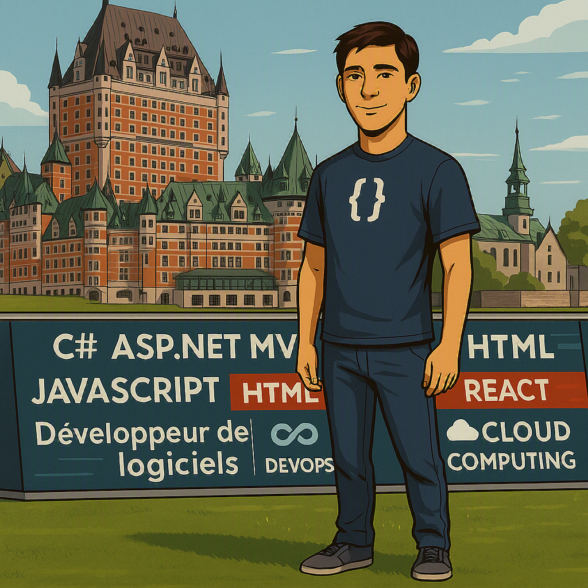

## Bonjour / Hello 👋

  ⚡ Ctrl + Click to open my website in a new tab
  

    
   
  
  
  <h3 align="center">
  🚀 Building scalable enterprise solutions with .NET & Cloud  
  </h3>
  

## 🌐 Live Demo

    
  

  
  
  
  
  
 

## 📄 Resume

## 🚀 Technologies I Use

  

## 📊 GitHub Stats

  

## 🚀 Featured Projects

### 🔹 Enterprise Application (.NET MVC)
- Development of scalable enterprise applications using ASP.NET MVC
- Implementation of clean architecture and layered design
- Integration with SQL Server and REST APIs

---

### 🔹 Microservices Architecture (.NET Core)
- Development of microservices using .NET Core
- API-first approach with RESTful services
- Integration with frontend frameworks (React / Angular)

---

### 🔹 Cloud & DevOps (Azure)
- CI/CD pipeline implementation using Azure DevOps
- Containerization with Docker and orchestration with Kubernetes
- Deployment of applications in cloud environments

---

### 🔹 Full-stack Development
- Frontend development with HTML, CSS, JavaScript, bootstrap
- Experience integrating modern frameworks (React / Angular)
- Full lifecycle development from backend to UI

- 🔭 I’m currently working on enterprise application modernization and integration projects using .NET technologies.

- 🌱 I’m currently learning and improving my skills in Cloud computing (Azure), DevOps practices, and modern frontend frameworks like React and Angular.

- 👯 I’m looking to collaborate on .NET backend projects, APIs, microservices, or full-stack applications.

- 🤔 I’m looking for help with advanced cloud architecture, DevOps automation, and scalable distributed systems.

- 💬 Ask me about C#, ASP.NET MVC, .NET Core, SQL Server, web development, and system integration.

- 📫 How to reach me: you can connect through GitHub or email (available in profile).

- 😄 Pronouns: he/him

- ⚡ Fun fact: Started with traditional multi-layer architectures and evolved into modern microservices and cloud-based systems.

- 🔭 Je travaille actuellement sur des projets de modernisation et d’intégration d’applications d’entreprise avec les technologies .NET.

- 🌱 J’améliore actuellement mes compétences en informatique en nuage (Azure), pratiques DevOps et frameworks frontend modernes comme React et Angular.

- 👯 Je suis ouvert à collaborer sur des projets backend .NET, des API, des microservices ou des applications full-stack.

- 🤔 Je cherche à approfondir mes connaissances en architecture cloud avancée, automatisation DevOps et systèmes distribués scalables.

- 💬 N’hésitez pas à me poser des questions sur C#, ASP.NET MVC, .NET Core, SQL Server, le développement web et l’intégration de systèmes.

- 📫 Comment me contacter : via GitHub ou par courriel (disponible sur mon profil).

- 😄 Pronoms : il/lui

- ⚡ Fun fact : carrière commencée avec des architectures multicouches traditionnelles et évoluée vers les microservices et le cloud.

- 🔭 Actualmente estoy trabajando en proyectos de modernización e integración de aplicaciones empresariales utilizando tecnologías .NET.

- 🌱 Actualmente estoy fortaleciendo mis habilidades en computación en la nube (Azure), prácticas DevOps y frameworks frontend modernos como React y Angular.

- 👯 Estoy abierto a colaborar en proyectos backend .NET, APIs, microservicios o aplicaciones full-stack.

- 🤔 Estoy interesado en profundizar mis conocimientos en arquitectura cloud avanzada, automatización DevOps y sistemas distribuidos escalables.

- 💬 Puedes preguntarme sobre C#, ASP.NET MVC, .NET Core, SQL Server, desarrollo web e integración de sistemas.

- 📫 Cómo contactarme: a través de GitHub o por correo electrónico (disponible en mi perfil).

- 😄 Pronombres: él

- ⚡ Dato curioso: comencé trabajando con arquitecturas multicapa tradicionales y evolucioné hacia microservicios y entornos cloud.
